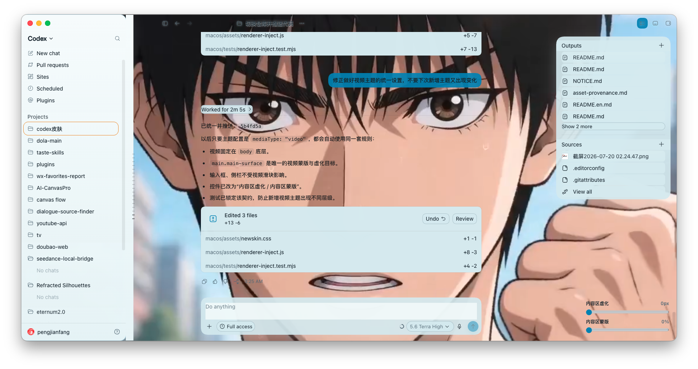
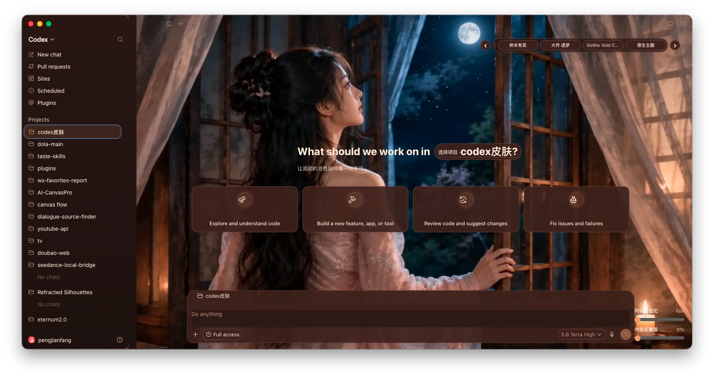
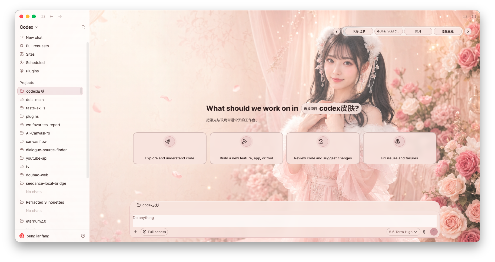
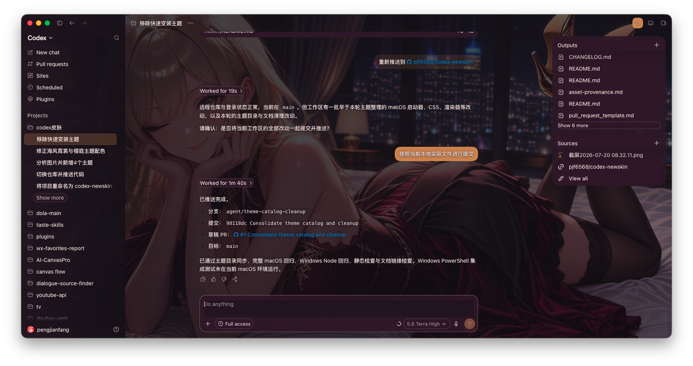

# Codex Newskin

<p align="center">
  <strong>中文</strong> · <a href="./README.en.md">English</a>
</p>

为官方 Codex Desktop 提供的本地主题工具。Codex Newskin 使用只绑定到
`127.0.0.1` 的 Chrome DevTools Protocol（CDP），将图片或视频作为 Codex
窗口背景，同时保持原生侧栏、任务、输入框和交互可用。

它不会修改官方应用、`app.asar`、WindowsApps、代码签名、API Key 或模型配置。

> 非 OpenAI 官方产品；Codex 是其权利人持有的商标。

## 主题效果预览

<p align="center">
  
  
</p>
<p align="center">
  
  
</p>

截图展示视频、月夜、樱庭与绯夜等主题在真实 Codex 工作台中的效果；主题始终保留原生侧栏、项目选择、任务与输入框交互。

## 支持的平台

| 平台 | 入口 | 主要要求 |
| --- | --- | --- |
| macOS | [`macos/README.md`](./macos/README.md) | 已安装并至少启动过一次官方 Codex Desktop |
| Windows | [`windows/README.md`](./windows/README.md) | 官方 Microsoft Store Codex、Node.js 22+、Windows PowerShell 5.1+ |

两个平台的安装器、运行时状态和恢复流程相互独立。请只运行与你的操作系统
对应的脚本。

## 快速开始

### macOS

在终端进入 `macos` 目录后执行：

```bash
./scripts/install-newskin-macos.sh --no-launch
```

安装后，使用桌面上的 `Codex Newskin.command` 应用主题；`Codex Newskin - Pause.command`
会只取消当前注入，`Codex Newskin - Restore.command` 则恢复官方外观。完整说明、主题导入、菜单栏
工具与视频背景支持见 [`macos/README.md`](./macos/README.md)。

### Windows

在 PowerShell 中于仓库根目录执行：

```powershell
powershell.exe -NoProfile -ExecutionPolicy Bypass -File .\windows\scripts\install-newskin.ps1
```

之后使用安装器创建的 `Codex Newskin` 快捷方式启动。完整的验证、主题托盘和
恢复/卸载指引见 [`windows/README.md`](./windows/README.md)。

## 主题与安全边界

- 支持本地 PNG、JPEG、WebP 等图片；macOS 和 Windows 也支持静音循环的 MP4、WebM、MOV 视频背景。
- 请导入纯背景素材，不要使用含窗口、侧栏、输入框、按钮或可读文字的截图。
- CDP 是仅限本机的调试接口。使用主题期间，不要运行来源不明的本地程序；完成后可运行各平台的 Restore 命令恢复官方外观。
- 主题功能与 API 中转、模型供应商、Base URL 和凭证完全独立；请分别配置，并且不要将凭证提交到仓库。

## 仓库结构

```text
themes/     唯一可编辑的主题包、媒体和跨平台注册表
macos/      macOS 安装、主题管理、菜单栏工具、预设和测试
windows/    Windows 安装、托盘工具、主题管理和测试
.github/    Issue、PR 与持续集成配置
```

每个已验证主题的配置与图片／视频都只在 [`themes/`](./themes/README.md)
维护；macOS 与 Windows 的预设目录是自动生成的发布副本。Windows 会在安装或
更新时将内置预设播种到「已保存主题」和首页主题轮换控件。

## 验证

macOS：

```bash
(cd macos && npm test)
```

主题目录同步校验：

```bash
node tools/sync-theme-catalog.mjs
```

Windows：

```powershell
powershell.exe -NoProfile -ExecutionPolicy Bypass -File .\windows\tests\run-tests.ps1
```

对于安装、启动、注入或恢复改动，还应运行受影响平台的 `verify-newskin` 脚本，
并在首页和普通任务页手动检查可读性与交互。

## 许可

软件以 [MIT License](./macos/LICENSE) 发布；第三方素材、商标和运行时相关说明见
[`macos/NOTICE.md`](./macos/NOTICE.md)。
